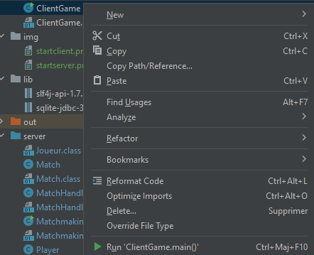

# Projet Dev

# FRENCH 
## Comment démarrer le server

---
**VOUS AVEZ BESOIN DE JAVA 21**

Tout d'abord vous devez accéder au dossier `server`:
```
cd server
```

Vous pouvez ensuite démarrer le fichier ``MatchmaingServer.java``, en écrivant dans le terminal une fois que vous êtes dans le dossier server : ``java MatchmakingServer.java``

Ou si vous utilisez IntelliJ, vous pouvez simplement le démarrer en faisant clique droit sur le dossier `MatchmakingServer`


## Comment jouer au jeu

--- 
Vous avez simplement besoin d'aller dans le dossier ``server`` :
``cd server``

Vous pouvez ensuite démarrer le client en écrivant dans votre terminal : ``java ../client/ClientGame.java``

ou si vous êtes sur IntelliJ, en faisant clique droit sur le fichier and en cliquant sur run



## Qu'est ce que c'est comme jeu

---
Le jeu auquel vous pouvez jouer est le morpion, il y a 2 modes, vous pouvez choisir de sois jouer seul contre une "IA", ou bien contre un autre joueur en multijoueur


---

## Joueur Solo
Si vous décidez de jouer seule, la partie commencera instantanément, et vous serez contre une "IA"


---

## Multi-joueur
Si vous décidez de jouer en multi-joueur, vous devrez d'abord entrer l'ip de la machine qui à lancer le server, si vous êtes la machine qui a lancé le serveur vous pouvez simplement écrire localhost, et vous devrez ensuite choisir votre pseudonyme


Si la partie ne commence pas tout de suite après avoir choisi votre nom d'utilisateur, c'est parce que vous êtes le seul joueur connecté au serveur, une fois qu'un autre joueur sera connecté et qu'il aura choisi son pseudonyme, la partie commencera tout de suite après.
# 

---
#


# ENGLISH
## How to start the server

---
**YOU NEED TO HAVE JAVA 21**

First you'll have to get to the server folder to start the server
```
cd server
```

You can then start the ``MatchmaingServer.java`` file, by writing in your terminal once you're in the server folder by doing : ``java MatchmakingServer.java`` 

Or if you're using intelliJ you can simply start it by either right-clicking and clicking on run


## How to play the game

--- 
You simply have to go into the client folder by doing : 
``cd server`` 

Then you can either start your client by doing : ``java ../client/ClientGame.java``

or if you're on intellij by right-clicking on the file and clicking on run


## What is the game

---
The game you can play is Tic Tac Toe, you have 2 modes, you can either choose to play multiplayer or play alone against an AI


---

## Solo Player
If you decide to play alone, the game will instantly start, and you'll be playing against an AI 


---

## Multiplayer
If you decide to play multiplayer, you'll have to enter the ip address you're connecting to, if you're the host of the server you can simply write localhost, and if you're connecting to the server you have to enter the ip of the machine you're connecting to, then you'll have to choose your username.


If the game doesn't start once you've chosed your username, it's because you're the only player on the server, once another player connect to the server and once he chosed his username, you both will be able to play the game.


